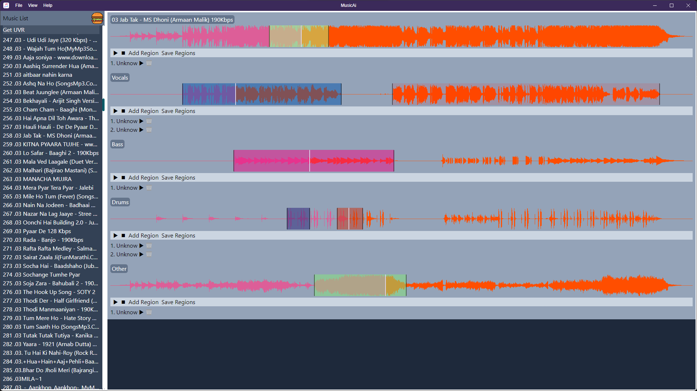

# MusicAi

Eletron Music App for Miscellaneous functionalities

Run 

`npm start`

Windows build

`npm run package`

## Motivation
I really don't have natual sense of music but as a listener I love to listen songs. I mostly like the chill and vocal based songs rather than too loud and rapp stuff but it also depends on mood as well. Sometimes, I just feel like keep listening to that one song for eternity :D itself. I really appreciate the efforts put into it and the motivation behind, also understand its hard to keep giving the same vibes all the time. Sometimes, I just put one song on loop and still dont get bored with it. So, I had an idea that if I have a lot of favorite songs and specific favorite part from that song and I just put them all together it will be really good. 

## End-Goal
An application which takes the path to songs and create database for 
- [ ] Auto generate small clips
- [ ] Play small clips in sync and with rythm
- [ ] auto generate mashups, given the params like tempo, key, mood, singer, etc.

Songs  => Demixed => Regions    => Patching ( mashup ).

Source => UVR IO  => Clustering => Auto/Manual Tools.

## v0.1
### MusicAi + UVR + Clustering
- [x] Use UVR Convert the Songs to 4 Streams
  - [x] basic set Up
  - [x] Process 2k Songs
    - [x] Plane default processing
    - [x] Look for full and optimized optimed option for doing same
- [x] Parse the Songs into the Music-Ai App
  - [x] Folder Schema for Data Source ( use prepross.py to prepare it )
  - [x] Show the Source song and other streams waves.
- [ ] Clustering Algo
  - [ ] Look for ways to cluster the vocals
  - [ ] Add auto clustering
  

## v0.2
### MusicAi with intergrated UVR.
- [ ] Look for Adv ways to cluster the vocals
  - [ ] Auto save clusters
- [ ] Minor UI Update
- [ ] Separate Tab for normal music player/ patch player and more..

## v0.3
### MusicAi with intergrated UVR. [ CUDA support ]

# About Music
  - **Tempo** is a speed at which song is played. Its it measured in beats per minute (BPM). Tempo decides for mood and energy of song as well. Tempo is italian word for time.
  - **Key** is a note around which the whole song revolves.

# TsReacTron [ Ts + React + Electon ]

  - **Main** 
  - **Renderer**
  - **IPC** is Inter-Process Communication between main and renderer code.