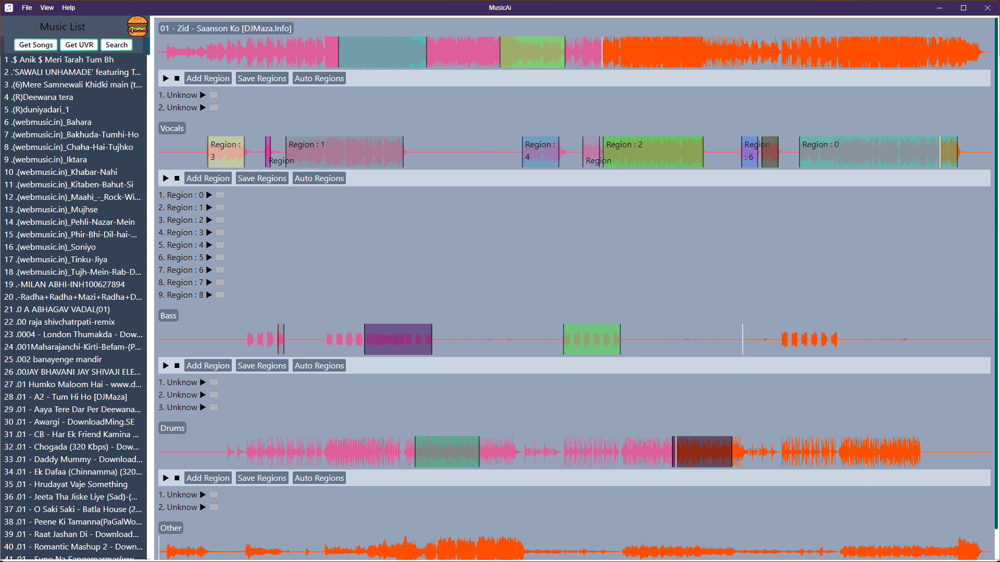
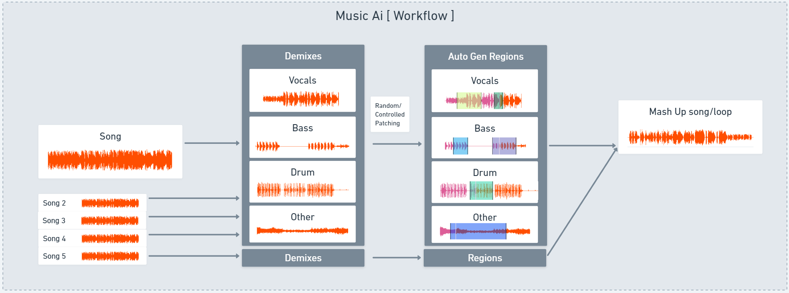

# MusicAi

Eletron Music App for Miscellaneous functionalities

Run 

`npm start`

Windows build

`npm run package`

## Motivation
I really don't have natual sense of music but as a listener I love to listen songs. I mostly like the chill and vocal based songs rather than too loud and rapp stuff but it also depends on mood as well. Sometimes, I just feel like keep listening to that one song for eternity :D itself. I really appreciate the efforts put into it and the motivation behind, also understand its hard to keep giving the same vibes all the time. Sometimes, I just put one song on loop and still dont get bored with it. So, I had an idea that if I have a lot of favorite songs and specific favorite parts from those songs and If I could just put them all together it will be a really good idea. 

## End-Goal
An application which takes the path to songs and create database for 
- [ ] Auto generate small clips [ Regions ]
- [ ] Play small clips in sync and with rythm
- [ ] auto generate mashups, given the params like tempo, key, mood, singer, etc.

 Songs => Demixed =>   Regions  => Patching ( mashup ).

Source => UVR  IO => Clustering => Auto/Manual Tools.

# Methods
## Create a patch for two regions with pre-trained models
  - Idea is to take two regions and create a patch with pre-trained models
    - How ?
  - Pre-Trained models
    - AudioCraft from meta
      - Its text to sound/music generator [ doesn't fit out purpose ]
    - Magenta
      - Its library to play and experiment with notes.
## Genre/note/bpm Detection and patching
  - Look for the models, to get info about regions and then play the matching info regions or patch it.
## Use Of transformer
Just like the LLM models, those are trained on the sequece of the text to generate the text. We can use same approach to train the transformer model to fill the patch we need.

## v0.3
### MusicAi with intergrated UVR. [ CUDA support ]

## v0.2
### MusicAi with intergrated UVR.
- [ ] Look for Adv ways to cluster the vocals
  - [ ] Auto save clusters as Regions
- [x] Minor UI Update
- [ ] Separate Tab for normal music player/ patch player and more..
  - [ ] Insights Tab
    - [ ] feature extractor like tempo, key, sampling rate
  - [ ] Mega Wave : React Router/mounting stuff

## v0.1
### MusicAi + UVR + Clustering
- [x] Use UVR Convert the Songs to 4 Streams
  - [x] basic set Up
  - [x] Process 2k Songs
    - [x] Plane default processing
    - [x] Look for full and optimized optimed option for doing same
- [x] Parse the Songs into the Music-Ai App
  - [x] Folder Schema for Data Source ( use prepross.py to prepare it )
  - [x] Show the Source song and other streams waves.
- [x] Clustering Algo
  - [x] Look for ways to cluster the vocals
  - [x] Add auto clustering
- [ ] Final Checks / Minor Features
  - [x] Readme > Folder Structure
  - [ ] Save Regions Functionality
  - [ ] Get saved Regions Functionality
  

# Folder Structrure
Pre-Processing is needed to generate this folder hierarchy structure.
- Use [Universal Vocal Remover](https://ultimatevocalremover.com/) to extract the 4 types of demix [ Vocals, Bass, Drums, Others] 
- Use prepross.py from MusicAi-demucs
- get-folders -> [ currently hard-setted to UVR_DEMO]
- UVR_DEMO
  - List of folders with song names
  - Each folder contains
    - song file
    - Demixes folder
      - 4 types of demix [ Vocals, Bass, Drums, Others]
    - Info file [ patches, genre, etc]

# About Music
  - **Tempo** is a speed at which song is played. Its it measured in beats per minute (BPM). Tempo decides for mood and energy of song as well. Tempo is italian word for time.
  - **Key** is a note around which the whole song revolves.
  - **Sound** is variations in air pressure above and below the normal air pressure level. This difference travels at speed of ~340 m/s.
  - **Frequence** is the speed of the variation of air pressure. The source produce the sound at frequency ranging from 20-20k Hertz. This means the no. of times air pressues changes in a second.
  - **Amplitude** is how large the pressure variations are.
  - **Waveform** is change in Amplitude ( y-axis ) over the period of time ( x-axis ).
  - **Sample rate** is the number of samples per second that are taken of a waveform to create a discete digital signal. Measured in kHz. Normal is 16-bit 44.1kHz . can go up to 96-320kHz. But humans can hear up to 20kHz only. 
  - **channel** is the source of the audio. Stereo audio files will have two channels ( left and right) and 5.1 surround sound will have 6 channels.  

# TsReacTron [ Ts + React + Electron ]

  - **Main** 
  - **Renderer**
  - **IPC** is Inter-Process Communication between main and renderer code.